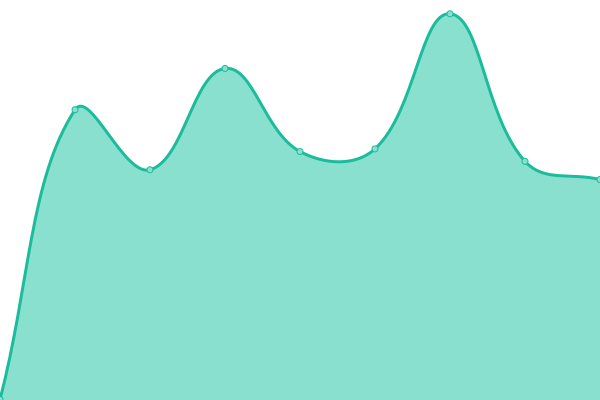
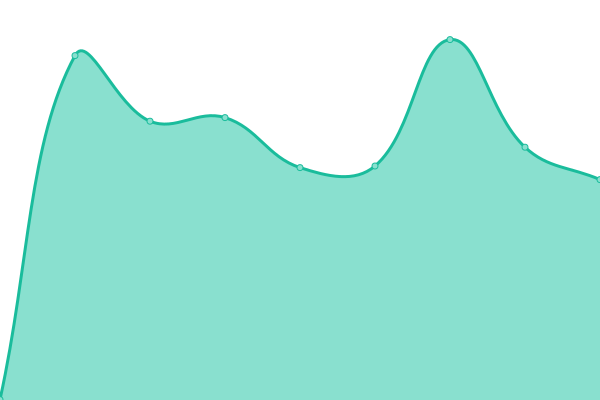
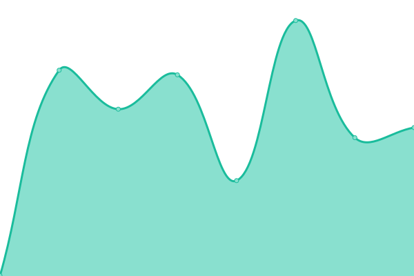

# [📈 Live Status](https://status.64i.de): <!--live status--> **🟩 All systems operational**

This repository contains the open-source uptime monitor and status page for [calvin_thefreak](https://64i.de/), powered by [Upptime](https://github.com/upptime/upptime).

With [Upptime](https://upptime.js.org), you can get your own unlimited and free uptime monitor and status page, powered entirely by a GitHub repository. We use [Issues](https://github.com/calvinthefreak/uptime/issues) as incident reports, [Actions](https://github.com/calvinthefreak/uptime/actions) as uptime monitors, and [Pages](https://status.64i.de) for the status page.

<!--start: status pages-->
<!-- This summary is generated by Upptime (https://github.com/upptime/upptime) -->
<!-- Do not edit this manually, your changes will be overwritten -->
<!-- prettier-ignore -->
| URL | Status | History | Response Time | Uptime |
| --- | ------ | ------- | ------------- | ------ |
|  [64i.de](https://64i.de) | 🟩 Up | [64i-de.yml](https://github.com/calvinthefreak/uptime/commits/HEAD/history/64i-de.yml) | 

 915ms
     
 | 

<a href="https://status.64i.de/history/64i-de">100.00%</a>
    

|  [nextcloud.64i.de](https://nextcloud.64i.de) | 🟩 Up | [nextcloud-64i-de.yml](https://github.com/calvinthefreak/uptime/commits/HEAD/history/nextcloud-64i-de.yml) | 

 764ms
     
 | 

<a href="https://status.64i.de/history/nextcloud-64i-de">100.00%</a>
    

|  [mail.64i.de (web)](https://mail.64i.de) | 🟩 Up | [mail-64i-de-web.yml](https://github.com/calvinthefreak/uptime/commits/HEAD/history/mail-64i-de-web.yml) | 

 718ms
     
 | 

<a href="https://status.64i.de/history/mail-64i-de-web">100.00%</a>
    

|  [mail.64i.de (smtp)](mail.64i.de) | 🟩 Up | [mail-64i-de-smtp.yml](https://github.com/calvinthefreak/uptime/commits/HEAD/history/mail-64i-de-smtp.yml) | 

 122ms
     
 | 

<a href="https://status.64i.de/history/mail-64i-de-smtp">100.00%</a>
    

|  [mail.64i.de (smtps)](mail.64i.de) | 🟩 Up | [mail-64i-de-smtps.yml](https://github.com/calvinthefreak/uptime/commits/HEAD/history/mail-64i-de-smtps.yml) | 

 122ms
     
 | 

<a href="https://status.64i.de/history/mail-64i-de-smtps">100.00%</a>
    

|  [vortex.64i.de](https://vortex.64i.de/) | 🟩 Up | [vortex-64i-de.yml](https://github.com/calvinthefreak/uptime/commits/HEAD/history/vortex-64i-de.yml) | 

 587ms
     
 | 

<a href="https://status.64i.de/history/vortex-64i-de">100.00%</a>
    

|  [vortexcdn.64i.de](https://vortexcdn.64i.de/vlp6p46n7ts.png) | 🟩 Up | [vortexcdn-64i-de.yml](https://github.com/calvinthefreak/uptime/commits/HEAD/history/vortexcdn-64i-de.yml) | 

 205ms
     
 | 

<a href="https://status.64i.de/history/vortexcdn-64i-de">100.00%</a>
    

|  [git.64i.de](https://git.64i.de/) | 🟩 Up | [git-64i-de.yml](https://github.com/calvinthefreak/uptime/commits/HEAD/history/git-64i-de.yml) | 

 652ms
     
 | 

<a href="https://status.64i.de/history/git-64i-de">100.00%</a>
    

|  [x11.moe](https://x11.moe) | 🟩 Up | [x11-moe.yml](https://github.com/calvinthefreak/uptime/commits/HEAD/history/x11-moe.yml) | 

 622ms
     
 | 

<a href="https://status.64i.de/history/x11-moe">100.00%</a>
    

<!--end: status pages-->

[**Visit our status website →**](https://status.64i.de)

## 📄 License

- Powered by: [Upptime](https://github.com/upptime/upptime)
- Code: [MIT](./LICENSE) © [calvin_thefreak](https://64i.de/)
- Data in the `./history` directory: [Open Database License](https://opendatacommons.org/licenses/odbl/1-0/)
